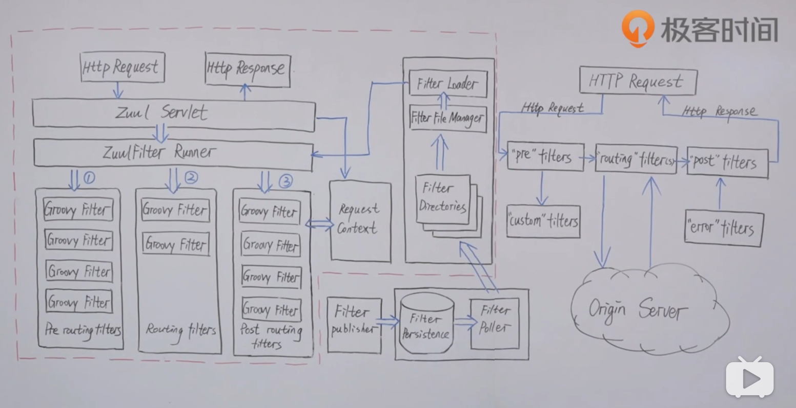

https://www.bilibili.com/video/BV1FZ4y1H7yb?p=14

架构师：杨波  携程

2020-07-29 与浙江省杭州市阿里巴巴未来科技城park记录。

# 微服务架构扫盲

## 01讲：什么是微服务架构

> 计算机大牛martin follower，2014年博客博文，讲微服务概念。
>
> 前netflex的架构总监Adrain Cockcroft。

> **马丁福勒的定义：**微服务具有6个特点。
>
> **netflex前架构总监Adrain Cockcroft的定义：**Loosely Coupled Service Oriented Architecture with bounded Context.

## 02讲：架构师如何权衡微服务的利和弊

| 利                                   | 弊（挑战）   |
| ------------------------------------ | ------------ |
| 强模块化边界（类--->组件--->微服务） | 分布式复杂性 |
| 可独立部署                           | 最终一致性   |
| 技术多样性                           | 运维复杂性   |
|                                      | 测试复杂性   |

## 03讲：康威法则和微服务给架构师怎样的启示？

> **康威法则：**1967年提出。设计系统的组织，其产生的设计和架构等价于组织的组织架构。康威法则是微服务的理论基础。

> **给架构师的启示：**架构师一直是做技术性的问题。启示架构师除了做技术架构之外，还需要做组织架构方面的考虑。

## 04讲：企业应该在什么时候开始考虑引入微服务？

> **初略估计：**团队100人规模之后，可以开始考虑微服务架构。

> **实施路径：**
>
> - 单体先策略：是推荐的策略，先期商业模式未得到验证，随着业务的延伸和扩展，后期逐渐演化为微服务架构。
> - 微服务优先策略

            

## 05讲：什么样的组织架构更适合微服务？

> 整个小团队是围绕着微服务域来组织的，小团队规模（亚马逊提出的2个pizza原则，即12人）。团队内部形成闭环，对外交付可用的产品和接口。
>
> 亚马逊的CTO：who build it，who run it。（谁开发的，谁负责构建负责运行） 

## 06讲：如何理解阿里巴巴提出的微服务中台战略？

> 马云2015年去欧洲（芬兰）公司Supercell参观，Supercell的营收能力极强，但是团队成员很少。回来之后给阿里巴巴集团提供中台战略。

> Iaas：基础设施即服务。基础运维团队来负责。
>
> Paas：平台即服务。
>
> 核心业务层：
>
> 应用层：

> **大中台，小应用。**理念：赋能业务的持续创新，响应不同的业务模式。
>
> 阿里巴巴吧下面两层叫做“技术中台”，第三层叫做“业务中台”，上层叫做“业务前台”。

## 07讲：如何给出一个清晰简洁的服务分层方式

## 08讲：微服务总体技术架构体系是怎样设计的？

IAM：identity and access managment.认证和接入管理。

## 09讲：微服务的服务发现机制

| 模式                           | 策略                                                         | 优点                                 | 缺点                                                         |
| ------------------------------ | ------------------------------------------------------------ | ------------------------------------ | ------------------------------------------------------------ |
| **模式01：传统的基于lb的模式** | 有个独立的集中式负载均衡器（硬件F5，或者，软件nginx）        | 简单、接入成本低                     | 集中的lb是个单点，存在单点问题。 性能上有损失，消费者调用的时候需要去穿透 |
| **模式02：进程内的LB模式**     | 把上面LB的功能做到消费端的应用进程内。服务提供方自动注册到服务注册中心，并定期发送心跳。 | 性能好、不存在单点问题               | 没个客户端需要开发客户端。升级维护成本高、多语言支持差。     |
| **模式03：主机独立的LB模式**   | 既不在链路上放集中式LB，也不把LB放到进程中，而是在每个主机上放一个LB。 | 没有第一种单点问题。也可以支持多语言 | 运维成本相对较高。每台主机上要部署。                         |

> 最近在业界有个新概念：**service-mesh（服务网格）**

## 10讲：微服务API服务网关原理一

## 11讲：微服务API服务网关原理二-------开源网关zuul

> 为什么需要网关？
>
> 就像门卫。微服务中有很多微服务（例如购物车，库存，推荐，订单），但是我们不希望外界客户在访问的时候知道这些细节。让网关来屏蔽这部分细节，让客户访问的时候只使用同一服务接口。也就是网关屏蔽了内部服务细节。

> ***实际中分层的网关所处的位置：***
>
> **用户接入设备：**
>
> **负载均衡器:**网关是无状态的，可以部署很多，杜绝网关的单点问题。
>
> **网关层：**反向路由（外面的请求转换成内部服务的调用）；安全认证（企业的门卫）；限流熔断（突发流量，流量洪峰）；日志监控（记录访问日志）
>
> **微服务:**

> zuul实际上是一个servlet，他运行在tomcat容器当中。
>
> zuulFilter Runner管理了zuul内部所有的过滤器。
>
> 所有的过滤器分为三个层次：
>
> 1. 前置路由过滤器
> 2. 路由过滤器
> 3. 后置路由过滤器
>
> 他们都是groovy脚本，可以实现动态插拔。因为网关不能够经常性的部署，但是又需要时常添加一些逻辑

## 12讲：微服务的路由发现体系

前面的服务分层、发现、网关。今天以路由发现体系，来吧这些点如何串起来的。

## 13讲：集中式配置中心的作用和原理是什么？

> 为什么需要集中式配置中心？
>
> 如果没有：配置不标准，格式不统一。没有审计，谁提交的配置，谁修改的，难以追溯。

> 配置更新模式：
>
> - 拉模式pull
> - 推模式push

> 携程的配置中心apollo

## 14讲：微服务通讯方式RPC vs REST

|                | RPC                                | REST                                 |
| -------------- | ---------------------------------- | ------------------------------------ |
| 1、耦合性      | 强耦合                             | 松散耦合                             |
| 2、消息协议    | 二进制 thrift protobuf avro        | 文本xml，json                        |
| 3、通讯协议    | TCP                                | HTTP/HTTP2.0                         |
| 4、性能        | 高                                 | 一般低于RPC                          |
| 5、接口契约IDL | thrift protobuf IDL                | Swagger                              |
| 6、客户端      | 强类型客户端，一般自动生成，多语言 | 一般HTTP                             |
| 7、案例        | Dubbo、matan、tars、grpc、thrift   | SpringMVC/Boot、Jax-rs、dropwizard   |
| 8、开发者友好  | 客户端比较方便但二进制消息不可读   | 文本消息开发者刻读，浏览器就可以访问 |
| 9、对外开放    | 对外一般需要先转换成REST/文本协议  | 直接可以对外开放                     |

## 15讲：微服务架构需要考虑哪些治理环节

## 16讲：微服务的监控分层和架构

> ELK：日志分析系统
>
> ​           Elasticsearch是实时全文搜索和分析引擎，提供搜集、分析、存储数据三大功能
>
> ​           Logstash是一个用来搜集、分析、过滤日志的工具。
>
> ​           Kibana是一个基于Web的图形界面，用于搜索、分析和可视化存储在 Elasticsearch指标中的日志数据。
>
> InfluxDB：时间序列数据库
>
> Grafana：时间序列呈现展示
> Nagios：

## 17讲：微服务的调用链监控

> 2010年google率先提出了调用链监控。

> CAT：点评
>
> zipkin：twitter
>
> pinpain：韩国

> Matric：
>
> Dashboard：

## 18讲：微服务的限流熔断是如何工作的

> NetFlex在2010年之前也没有好的熔断措施。2012年启动了弹性工程项目，其中一个项目叫做Hystrix。
>
> **概念**
>
> 熔断：类似保险丝，一个部件出问题，不会导致整个系统瘫痪。
>
> 隔离：计算机资源是有限的（内存，cpu，队列，线程池）。如果不进行隔离，一个服务的调用要消耗很多的线程资源，就有可能一个服务的捣蛋，导致整个系统摊款。
>
> 限流：当大流量冲击网站的时候，要有一点的限流措施，比如一定时间只允许100个请求过。
>
> 降级：系统后台无法提供后台的服务性能。提供一种降级能力，牺牲部分体验，支持系统基本可用。

## 19讲：容器部署技术&持续交付流水线

## 20讲：容器集群调度和基于容器的发布体系

> google的秘密项目**Mesos**，需要签署保密协议。容器资源调度平台。
>
> 后来工程师流出，逐渐开源。
>
> **K8s**也是容器资源调度平台

